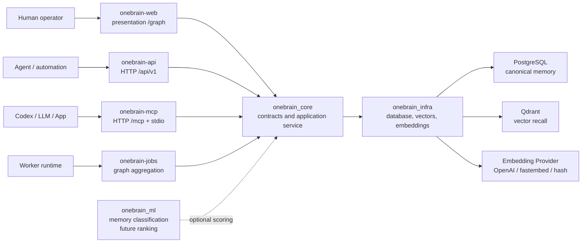
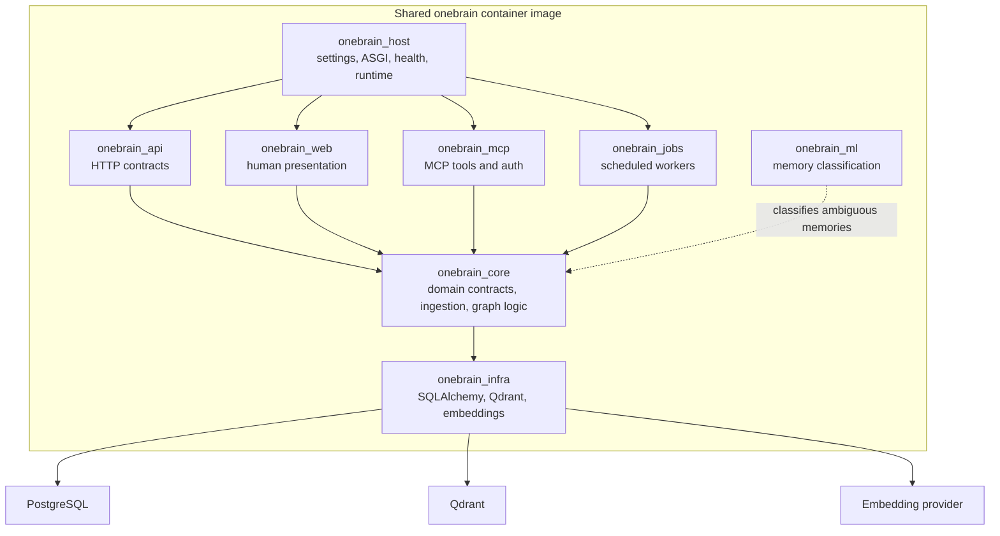
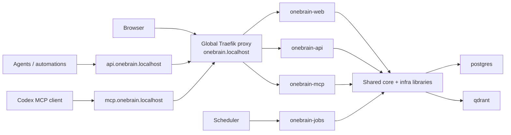

# OneBrain

OneBrain is a production-oriented memory service for LLM tools, coding agents, and personal agent workflows. It stores durable memories in PostgreSQL, indexes semantic recall vectors in Qdrant, and exposes separate API, Web, MCP, and Jobs service surfaces for enterprise usage.

OneBrain does not use an LLM in its online request path. The service remembers, retrieves, ranks, and explains. The calling LLM, such as Codex, is responsible for deeper reasoning over the context returned by OneBrain.

## What OneBrain Does

- Captures durable memories with scope, tags, source, confidence, and entities.
- Captures declarative skills as procedural memories with capabilities, tools, and versions.
- Stores canonical state in PostgreSQL.
- Stores embeddings in Qdrant for semantic recall.
- Builds a correlation view across memories, skills, workflows, and shared entities.
- Builds deterministic context packs for LLM callers.
- Classifies imported memory type with heuristic guardrails plus a lightweight ML fallback.
- Exposes OneBrain Web for human graph exploration.
- Exposes OneBrain API for memory, skill, graph, and contextual ingestion workflows.
- Exposes OneBrain MCP over HTTP and stdio for Codex and other MCP clients.
- Runs graph aggregation and future workers through OneBrain Jobs.
- Supports API key authentication for deployed HTTP usage.
- Runs with Docker Compose, with a separate local Traefik proxy stack plus PostgreSQL, Qdrant, migrations, API, Web, MCP, and Jobs services.

## Architecture



Core responsibilities:

- **PostgreSQL**: source of truth for memories, entities, relations, audit events, metadata, and validity windows.
- **Qdrant**: vector index for recall and similarity search.
- **onebrain_web**: enterprise human surface for graph exploration and future operations screens.
- **onebrain_api**: enterprise HTTP API for memory capture, skills, graph contracts, context packs, and contextual ingestion.
- **onebrain_mcp**: agent interface for capture, search, correlation, and context composition.
- **onebrain_jobs**: background workers and schedulers, starting with graph aggregation.
- **onebrain_host**: Django, ASGI, URL, settings, and runtime composition.
- **onebrain_ml**: lightweight machine-learning extensions, starting with memory type classification.
- **Graph view**: local visual map of semantic, explicit, and shared-entity correlations.
- **Calling LLM**: reasoning, interpretation, conflict analysis, and task-specific decisions.

## Service Composition Graph





## Repository Layout

```text
.
+-- src/onebrain_core/         # Domain contracts, application service, ingestion, graph logic
+-- src/onebrain_infra/        # PostgreSQL, Qdrant, embeddings, and SQLAlchemy models
+-- src/onebrain_api/          # HTTP API surface and OpenAPI contract
+-- src/onebrain_web/          # Human presentation surface and graph UI
+-- src/onebrain_mcp/          # MCP tools, auth, stdio, and HTTP ASGI app
+-- src/onebrain_jobs/         # Background jobs, schedulers, and Django management commands
+-- src/onebrain_host/         # Django/ASGI/runtime composition and health endpoints
+-- src/onebrain_ml/           # ML memory classification and future ranking/correlation work
+-- src/onebrain_django/       # Compatibility namespace for the former monolith package
+-- manage.py                  # Host management entry point
+-- migrations/                # Alembic migrations
+-- tests/                     # Unit tests
+-- docker-compose.yml         # PostgreSQL, Qdrant, migrations, API, Web, MCP, Jobs
+-- docker-compose.traefik.yml # Shared local Traefik proxy and proxy network
+-- Dockerfile                 # Production container image
+-- .env.example               # Local configuration template
+-- CONTRIBUTING.md            # Contribution guide
+-- LICENSE                    # Apache License 2.0
```

## Requirements

- Docker 27+ with Docker Compose.
- Optional for local development outside Docker:
  - Python 3.11+
  - `uv`

## Quick Start With Docker Compose

Create a local environment file:

```powershell
Copy-Item .env.example .env
```

Start the shared local proxy once, unless you already have a Traefik container attached to
`local_proxy`:

```powershell
docker compose -f docker-compose.traefik.yml up -d
```

Start the OneBrain stack:

```powershell
docker compose up -d --build
```

The Traefik compose creates the reusable proxy network and starts:

- `traefik`, the local reverse proxy

The OneBrain compose starts:

- `postgres`
- `qdrant`
- `migrate`, which runs `alembic upgrade head`
- `onebrain-api`, the protected HTTP API surface
- `onebrain-web`, the human presentation and graph surface
- `onebrain-mcp`, the MCP HTTP surface
- `onebrain-jobs`, the graph aggregation scheduler

Check status:

```powershell
docker compose -f docker-compose.traefik.yml ps
docker compose ps
```

Open:

- Web console: `http://onebrain.localhost/`
- Web graph: `http://onebrain.localhost/graph`
- API health: `http://api.onebrain.localhost/healthz`
- API: `http://api.onebrain.localhost/api/v1`
- MCP HTTP: `http://mcp.onebrain.localhost/mcp`
- Traefik dashboard: `http://traefik.localhost/dashboard/`

The `.localhost` names are intended for local browser usage. If a CLI tool or resolver does not
handle wildcard `.localhost` subdomains, Traefik also accepts DNS-based loopback fallbacks:

- Web: `http://onebrain.127.0.0.1.sslip.io/`
- API: `http://api.127.0.0.1.sslip.io/api/v1`
- MCP: `http://mcp.127.0.0.1.sslip.io/mcp`
- Traefik dashboard: `http://traefik.127.0.0.1.sslip.io/dashboard/`

Stop the OneBrain stack:

```powershell
docker compose down
```

Stop the shared local proxy only when no local stack needs it:

```powershell
docker compose -f docker-compose.traefik.yml down
```

OneBrain stores PostgreSQL, Qdrant, job state, and ML artifacts in external Docker volumes by
default. Use `.\scripts\onebrain-lab-reset.ps1 -Apply` only when you intentionally want to purge the
local knowledge database.

## Docker Compose Services

`docker-compose.traefik.yml` owns the shared local proxy:

| Service | Purpose |
| --- | --- |
| `traefik` | Local reverse proxy for Web, API, MCP, and dashboard hostnames |

`docker-compose.yml` owns the OneBrain application stack:

| Service | Purpose |
| --- | --- |
| `postgres` | PostgreSQL canonical memory store |
| `qdrant` | Vector database for semantic recall |
| `migrate` | One-shot Alembic migration runner |
| `onebrain-api` | HTTP API, OpenAPI, ingestion, search, context, and graph contracts |
| `onebrain-web` | Human console and graph exploration surface |
| `onebrain-mcp` | MCP HTTP endpoint for Codex and other MCP clients |
| `onebrain-jobs` | Scheduled graph aggregation worker |

The Compose file overrides container network URLs automatically:

- Docker services use `postgres:5432`, not `localhost:5432`.
- Docker services use `qdrant:6333`, not `localhost:6333`.
- API, Web, and MCP join the external `${ONEBRAIN_PROXY_NETWORK:-local_proxy}` network so
  a shared Traefik can route friendly local hostnames.
- The API, MCP, and Jobs services mount `C:\DoxieOS\github-private-catalog` as
  `/mnt/github-private-catalog` for private catalog ingestion and MCP file imports.

Your `.env` can still use `localhost` for host-based development.

## Configuration

Copy `.env.example` to `.env` and adjust values.

Important settings:

```env
ONEBRAIN_ENVIRONMENT=local
ONEBRAIN_API_KEYS=
ONEBRAIN_PROXY_PORT=80
ONEBRAIN_PROXY_NETWORK=local_proxy
ONEBRAIN_WEB_HOST=onebrain.localhost
ONEBRAIN_API_HOST=api.onebrain.localhost
ONEBRAIN_MCP_HOST=mcp.onebrain.localhost
ONEBRAIN_TRAEFIK_HOST=traefik.localhost
ONEBRAIN_MEMORY_CLASSIFIER_MODEL_PATH=artifacts/memory-classifier.json
ONEBRAIN_DJANGO_DATA_UPLOAD_MAX_MEMORY_SIZE=67108864
ONEBRAIN_MCP_REQUIRE_API_KEY=true

POSTGRES_DB=onebrain
POSTGRES_USER=onebrain
POSTGRES_PASSWORD=onebrain

ONEBRAIN_EMBEDDING_PROVIDER=hash
ONEBRAIN_EMBEDDING_MODEL=text-embedding-3-small
ONEBRAIN_OPENAI_API_KEY=
ONEBRAIN_VECTOR_SIZE=384
```

Embedding providers:

- `hash`: no-cost deterministic local embeddings. Good for smoke tests and local demos.
- `openai`: production semantic recall with OpenAI embeddings.
- `fastembed`: local semantic embeddings using the optional `semantic` extra.

For production OpenAI embeddings:

```env
ONEBRAIN_EMBEDDING_PROVIDER=openai
ONEBRAIN_EMBEDDING_MODEL=text-embedding-3-small
ONEBRAIN_OPENAI_API_KEY=sk-...
ONEBRAIN_VECTOR_SIZE=384
```

`text-embedding-3-small` supports configurable dimensions. OneBrain passes `ONEBRAIN_VECTOR_SIZE` to the embeddings API for `text-embedding-3*` models. If you change vector size after data exists, use a new Qdrant collection name or recreate the collection.

## Authentication

OneBrain API and MCP HTTP authentication are controlled by `ONEBRAIN_API_KEYS`.

For local development:

```env
ONEBRAIN_ENVIRONMENT=local
ONEBRAIN_API_KEYS=
```

An empty `ONEBRAIN_API_KEYS` disables HTTP auth. Use that only locally.

For protected usage:

```env
ONEBRAIN_ENVIRONMENT=production
ONEBRAIN_API_KEYS=dev-key-1,dev-key-2
```

Production startup fails if `ONEBRAIN_ENVIRONMENT=production` and no API key is configured.

Clients can authenticate with either header:

```http
Authorization: Bearer dev-key-1
```

or:

```http
X-API-Key: dev-key-1
```

Production recommendation:

- Put OneBrain behind TLS.
- Restrict network access to trusted callers.
- Rotate `ONEBRAIN_API_KEYS` periodically.
- Do not store secrets as memories.
- Use different API keys for humans, automation, and agents when possible.

For client configuration, set a local client-only environment variable, for example `ONEBRAIN_MCP_CLIENT_KEY=dev-key-1`, and point your MCP client at that variable.

## Service Surfaces

The split services use the same core and infra packages, while the shared Traefik stack exposes
friendly local hostnames:

```text
Web:     http://onebrain.localhost
API:     http://api.onebrain.localhost
MCP:     http://mcp.onebrain.localhost
Traefik: http://traefik.localhost
```

API routes:

- `POST /api/v1/memories`: protected memory capture.
- `POST /api/v1/skills`: protected skill capture.
- `POST /api/v1/ingestion/analyze`: protected contextual file analysis.
- `POST /api/v1/ingestion/commit`: protected contextual memory creation.
- `POST /api/v1/search`, `/api/v1/context`, `/api/v1/correlate`, `/api/v1/graph`: protected recall and graph contracts.

Web routes:

- `GET /`: human console.
- `GET /graph`: graph explorer for local visualization.
- `POST /graph/data`: public local graph data endpoint used by the page.

MCP routes:

- `POST /mcp`: protected streamable HTTP MCP endpoint.

The older `/v1/*` path is still routed by the API service as a compatibility alias. New integrations should use `/api/v1/*`.

### Graph Aggregation Job

Grouping opportunities detected by the graph can be materialized as aggregate `context` memories.
The core aggregation logic lives in `onebrain_core`; operational scheduling lives in
`onebrain_jobs`.

Run a one-shot aggregation:

```powershell
uv run onebrain-jobs aggregate_graph_memories `
  --scope-json '{"catalog":"private-engineering-catalog","source":"github-private-catalog"}' `
  --grouping-limit 25 `
  --correlation-limit 750
```

Run the scheduler locally:

```powershell
uv run onebrain-jobs run_scheduled_jobs `
  --job graph-aggregation `
  --interval-seconds 3600 `
  --scope-json '{"catalog":"private-engineering-catalog","source":"github-private-catalog"}'
```

Docker Compose also includes a `onebrain-jobs` service. It runs the same scheduler with
environment-configurable defaults:

- `ONEBRAIN_GRAPH_AGGREGATION_SCOPE_JSON`
- `ONEBRAIN_GRAPH_AGGREGATION_INTERVAL_SECONDS`
- `ONEBRAIN_GRAPH_AGGREGATION_LIMIT`
- `ONEBRAIN_GRAPH_AGGREGATION_CORRELATION_LIMIT`
- `ONEBRAIN_GRAPH_AGGREGATION_MAX_DEGREE`
- `ONEBRAIN_GRAPH_AGGREGATION_GROUPING_LIMIT`
- `ONEBRAIN_GRAPH_AGGREGATION_GROUPING_MIN_SIZE`

### Memory Type Classification

OneBrain classifies imported memories with two layers:

- **Heuristic guardrails**: explicit frontmatter, known paths, skill files, code/config extensions, and other high-confidence signals still win.
- **ML fallback**: ambiguous text is scored by `onebrain_ml.memory_classification`, a deterministic Naive Bayes classifier trained from seed examples plus accepted/corrected OneBrain memories for `rule`, `preference`, `workflow`, `skill`, `decision`, `pitfall`, `context`, `runbook`, `fact`, and `note`.

The selected classification is stored in each imported memory payload under:

```json
{
  "metadata": {
    "memory_classification": {
      "memory_type": "decision",
      "confidence": 0.73,
      "method": "ml",
      "model_version": "onebrain-memory-type-naive-bayes-v1",
      "reasons": ["text contains decision", "text contains consequences"]
    }
  }
}
```

This keeps classification explainable while giving OneBrain a feedback loop:

- Manual or heuristic high-confidence memories can become training examples.
- ML-classified memories are not used as training examples by default, which avoids self-training on unreviewed predictions.
- Accepted ML classifications can opt in with `metadata.memory_classification.accepted=true`.
- Corrections can opt in with `metadata.memory_type_correction.corrected_type`.
- Explicit labels can opt in with `metadata.classification_training.memory_type`.

Train, validate, cross-validate, and publish a runtime artifact from the current OneBrain memories:

```powershell
docker compose run --rm onebrain-jobs `
  onebrain-jobs train_memory_classifier `
  --model-out /var/lib/onebrain/ml/memory-classifier.json `
  --json
```

The Docker stack mounts `/var/lib/onebrain/ml` as the external `onebrain_ml_artifacts` volume, and API/Web/MCP load
`ONEBRAIN_MEMORY_CLASSIFIER_MODEL_PATH` from that shared location. The runtime watches the model
file timestamp, so a newly trained artifact is picked up on the next classification call.

For offline experiments with a labeled JSON/JSONL dataset:

```powershell
uv run onebrain-memory-classifier train `
  --dataset .\datasets\memory-classification.jsonl `
  --model-out .\artifacts\memory-classifier.json `
  --folds 5
```

For GitHub repos or local folders that should train the classifier without feeding OneBrain
memories, use `--training-docs`. The trainer reads the files, extracts only strong labels, and
never calls the ingestion API:

```powershell
git clone https://github.com/ciembor/agent-rules-books.git C:\DoxieOS\training-corpora\agent-rules-books

uv run onebrain-jobs train_memory_classifier `
  --training-docs C:\DoxieOS\training-corpora\agent-rules-books `
  --training-docs-source-ref-prefix github://ciembor/agent-rules-books `
  --model-out .\artifacts\memory-classifier.json `
  --max-examples-per-type 80 `
  --folds 3 `
  --json
```

Inside Docker, use the mounted private catalog path:

```powershell
docker compose run --rm onebrain-jobs `
  onebrain-jobs train_memory_classifier `
  --training-docs /mnt/github-private-catalog `
  --training-docs-source-ref-prefix catalog://github-private-catalog `
  --model-out /var/lib/onebrain/ml/memory-classifier.json `
  --folds 3 `
  --json
```

### Contextual Ingestion API

The ingestion API is intentionally two-phase. First analyze files into a plan with macro context memories and child section memories. Then commit the reviewed plan into OneBrain, creating explicit `contains` links between parent and child memories.

### Local Codex Context Importer

Use the local importer when source docs live on your machine and you want Codex CLI to learn,
categorize, and prepare durable knowledge before OneBrain stores it. The importer runs outside the
online request path: Codex CLI reads local docs as source evidence, creates richer knowledge
context locally, then the importer calls the API `/api/v1/ingestion/analyze` and
`/api/v1/ingestion/commit`.

When Docker serves the API, pass the local path and let the importer translate host paths into
container paths. The Compose stack mounts `C:\DoxieOS\github-private-catalog` as
`/mnt/github-private-catalog`; pass `--api-path` when importing through Docker.

```powershell
$env:ONEBRAIN_IMPORT_SCOPE_JSON = '{"organization":"abinbev","catalog":"private-engineering-catalog"}'
uv run onebrain-local-import `
  --docs C:\DoxieOS\github-private-catalog\libraries\ambevtech-developer-memory `
  --api-url http://api.onebrain.localhost/api/v1 `
  --api-key $env:ONEBRAIN_MCP_CLIENT_KEY `
  --source-type private-catalog-library `
  --source-ref-prefix catalog://private/libraries/ambevtech-developer-memory `
  --exclude-examples
```

Useful switches:

- `--dry-run`: contextualize and send a dry-run commit request without creating memories.
- `--analyze-only`: contextualize the plan and print it without calling commit.
- `--codex-model`: choose a Codex model for local contextualization.
- `--scope-json-file`: load scope from a UTF-8 JSON file when shell quoting is inconvenient.
- `--skip-codex`: use deterministic fallback context when debugging API import mechanics.

By default the importer learns from every eligible source document under `--docs`. Use
`--max-files` only for smoke tests or partial imports.

For clean corpus ingestion and graph-correlation experiments, use the lab runbook:
[docs/corpus-lab.md](docs/corpus-lab.md).

Analyze a catalog library from Docker:

```powershell
$headers = @{ Authorization = "Bearer dev-key-1" }
$body = @{
  path = "/mnt/github-private-catalog/libraries/ambevtech-developer-memory"
  source_type = "private-catalog-library"
  source_ref_prefix = "catalog://private/libraries/ambevtech-developer-memory"
  include_examples = $false
  scope = @{
    organization = "abinbev"
    catalog = "private-engineering-catalog"
    source = "private-catalog"
  }
} | ConvertTo-Json -Depth 20

$plan = Invoke-RestMethod http://api.onebrain.localhost/api/v1/ingestion/analyze `
  -Headers $headers `
  -Method Post `
  -ContentType "application/json" `
  -Body $body
```

Commit the plan:

```powershell
$commitBody = @{ plan = $plan; dry_run = $false } | ConvertTo-Json -Depth 100
Invoke-RestMethod http://api.onebrain.localhost/api/v1/ingestion/commit `
  -Headers $headers `
  -Method Post `
  -ContentType "application/json" `
  -Body $commitBody
```

If auth is enabled:

```powershell
$headers = @{ Authorization = "Bearer dev-key-1" }
```

If auth is disabled locally, omit `-Headers $headers`.

Capture a memory:

```powershell
$body = @{
  memory_type = "rule"
  title = "OneBrain runtime rule"
  content = "OneBrain must not use an LLM in the online context composer."
  scope = @{ project = "one-brain" }
  tags = @("architecture", "runtime")
  entities = @(
    @{ name = "OneBrain"; entity_type = "system" }
  )
  confidence = 1.0
  source = @{
    source_type = "user"
    source_ref = "initial design"
  }
} | ConvertTo-Json -Depth 8

Invoke-RestMethod http://api.onebrain.localhost/api/v1/memories `
  -Method Post `
  -ContentType "application/json" `
  -Body $body
```

Capture a skill:

```powershell
$body = @{
  name = "PR Reviewer"
  description = "Reviews pull requests before merge."
  instructions = "Inspect behavioral risk, missing tests, and integration impact."
  capabilities = @("code review", "test gap analysis")
  tools = @("onebrain_search_memory")
  scope = @{ project = "one-brain" }
  tags = @("delivery")
  version = "1.0.0"
} | ConvertTo-Json -Depth 8

Invoke-RestMethod http://api.onebrain.localhost/api/v1/skills `
  -Method Post `
  -ContentType "application/json" `
  -Body $body
```

Search memories:

```powershell
$body = @{
  query = "context composer without LLM"
  limit = 5
  filters = @{
    scope = @{ project = "one-brain" }
  }
} | ConvertTo-Json -Depth 8

Invoke-RestMethod http://api.onebrain.localhost/api/v1/search `
  -Method Post `
  -ContentType "application/json" `
  -Body $body
```

Build a context pack:

```powershell
$body = @{
  task = "How should OneBrain compose context?"
  scope = @{ project = "one-brain" }
  max_tokens = 1200
} | ConvertTo-Json -Depth 8

Invoke-RestMethod http://api.onebrain.localhost/api/v1/context `
  -Method Post `
  -ContentType "application/json" `
  -Body $body
```

Open the correlation graph UI:

```text
http://onebrain.localhost/graph
```

The visual page loads its correlation data through a local `/graph/data` route. The protected
`/api/v1/graph` contract remains available on the API service for agents, tools, and LLM callers.

## MCP Usage

OneBrain supports two MCP modes:

- **HTTP MCP**, recommended for Codex once Docker is running.
- **stdio MCP**, useful for local development.

Both modes use the OneBrain application service. HTTP MCP is hosted by `onebrain-mcp` and can run independently from Web and API.

### HTTP MCP

Start the shared proxy and the Docker stack:

```powershell
docker compose -f docker-compose.traefik.yml up -d
docker compose up -d --build
```

Make sure `.env` has:

```env
ONEBRAIN_API_KEYS=dev-key-1
ONEBRAIN_MCP_REQUIRE_API_KEY=true
```

The MCP HTTP endpoint is:

```text
http://mcp.onebrain.localhost/mcp
```

Recommended Codex config:

```toml
[mcp_servers.onebrain]
type = "http"
url = "http://mcp.onebrain.localhost/mcp"
bearer_token_env_var = "ONEBRAIN_MCP_CLIENT_KEY"
```

Set `ONEBRAIN_MCP_CLIENT_KEY` in your user environment so Codex can send it as a bearer token. Its value must match one entry in `ONEBRAIN_API_KEYS`.

### Stdio MCP

For local stdio usage, run the MCP server from the host:

```powershell
uv sync --dev
uv run onebrain-mcp
```

Example Codex config:

```toml
[mcp_servers.onebrain]
command = "uv"
args = ["run", "onebrain-mcp"]
cwd = "C:\\Repositories\\one-brain"
startup_timeout_sec = 20
tool_timeout_sec = 60
```

Because the MCP process starts with `cwd = "C:\\Repositories\\one-brain"`, it reads `.env` from this repository. That keeps API keys out of Codex config.

Available MCP tools:

- `onebrain_capture_memory`
- `onebrain_harden_memory`
- `onebrain_add_memory`
- `onebrain_harden_skill`
- `onebrain_add_skill`
- `onebrain_import_memory_files`
- `onebrain_search_memory`
- `onebrain_search_skills`
- `onebrain_get_graph`
- `onebrain_get_context`
- `onebrain_correlate`

Store one skill with source-ref dedupe:

```json
{
  "tool": "onebrain_add_skill",
  "arguments": {
    "skill": {
      "name": "PR Reviewer",
      "description": "Reviews pull requests before merge.",
      "instructions": "Inspect behavioral risk, missing tests, and integration impact.",
      "capabilities": ["code review", "test gap analysis"],
      "tools": ["onebrain_search_memory"],
      "scope": {
        "project": "one-brain"
      },
      "version": "1.0.0"
    },
    "dry_run": false
  }
}
```

Fetch a correlation slice for an agent or LLM caller:

```json
{
  "tool": "onebrain_get_graph",
  "arguments": {
    "query": "pull request review",
    "limit": 100,
    "memory_types": ["skill", "workflow", "rule"],
    "scope": {
      "project": "one-brain"
    },
    "include_entities": false,
    "include_relations": false,
    "include_correlations": true
  }
}
```

Bulk import local text files with hardening and exact `source_ref` dedupe:

```json
{
  "tool": "onebrain_import_memory_files",
  "arguments": {
    "path": "C:\\DoxieOS\\github-private-catalog\\libraries",
    "source_type": "private-catalog-library",
    "source_ref_prefix": "catalog://private/libraries",
    "scope": {
      "organization": "abinbev",
      "catalog": "private-engineering-catalog",
      "source": "private-catalog"
    },
    "dry_run": false
  }
}
```

Use `dry_run=true` to inspect counts, classifications, and redactions without storing
memories. The Docker Compose MCP service maps `C:\DoxieOS\github-private-catalog` to
`/mnt/github-private-catalog` so tools can read catalog libraries from inside the container.

## Local Development Without Docker Services

You can run dependencies in Docker and one host-composed process locally:

```powershell
docker compose up -d postgres qdrant
uv sync --dev
uv run alembic upgrade head
uv run onebrain-host
```

Or run separated local surfaces in different terminals:

```powershell
uv run onebrain-api
uv run onebrain-web
uv run onebrain-mcp-http
uv run onebrain-jobs run_scheduled_jobs --job graph-aggregation
```

Run tests:

```powershell
uv run pytest -q
```

Run lint:

```powershell
uv run ruff format .
uv run ruff check .
```

## Migrations

Docker Compose runs migrations automatically through the `migrate` service.

Run migrations manually:

```powershell
docker compose run --rm migrate
```

Host-based migration:

```powershell
uv run alembic upgrade head
```

Create a new migration after changing SQLAlchemy models:

```powershell
uv run alembic revision --autogenerate -m "describe change"
```

Review generated migrations before committing.

## Data Persistence

External Docker volumes:

- `onebrain_postgres_data`
- `onebrain_qdrant_storage`
- `onebrain_job_status`
- `onebrain_ml_artifacts`

Because these volumes are declared as external in `docker-compose.yml`, normal container restarts,
`docker compose down`, and project renames do not remove them.

Backup expectations for production:

- PostgreSQL backups with PITR where possible.
- Qdrant snapshots.
- Memory classifier artifacts when trained models are promoted.
- Migration history kept in source control.
- Explicit restore drills before relying on backups.

## Production Checklist

- Set `ONEBRAIN_ENVIRONMENT=production`.
- Set `ONEBRAIN_API_KEYS`.
- Set `ONEBRAIN_EMBEDDING_PROVIDER=openai`.
- Set `ONEBRAIN_OPENAI_API_KEY`.
- Use strong PostgreSQL credentials.
- Do not expose PostgreSQL or Qdrant publicly.
- Put HTTP behind TLS and a trusted ingress.
- Enable platform logs and metrics.
- Run `docker compose -f docker-compose.traefik.yml up -d` before app deployments that use the shared local proxy network.
- Run `docker compose up -d --build` only after migrations are reviewed.
- Keep `.env` out of Git.

## Troubleshooting

Check service health:

```powershell
docker compose ps
docker compose logs -f onebrain-api
docker compose logs -f onebrain-web
docker compose logs -f onebrain-mcp
docker compose logs -f onebrain-jobs
docker compose logs -f migrate
```

If MCP cannot connect to Postgres inside Docker, verify the Compose override uses `postgres:5432`.

If Docker reports that `local_proxy` was declared as external but could not be found, start the
shared proxy stack first:

```powershell
docker compose -f docker-compose.traefik.yml up -d
```

If Qdrant vector size errors appear, the existing collection was created with a different vector size. Change `ONEBRAIN_QDRANT_COLLECTION` or recreate the Qdrant volume.

If OpenAI embeddings fail at startup, verify:

```env
ONEBRAIN_EMBEDDING_PROVIDER=openai
ONEBRAIN_OPENAI_API_KEY=sk-...
```

For no-cost local testing, use:

```env
ONEBRAIN_EMBEDDING_PROVIDER=hash
```

## Contributing

Contributions are welcome. See [CONTRIBUTING.md](CONTRIBUTING.md) for the full workflow.

Short version:

1. Create a branch.
2. Keep changes focused.
3. Add or update tests.
4. Run `uv run ruff format .`, `uv run ruff check .`, and `uv run pytest -q`.
5. Update docs when behavior or configuration changes.

## License

OneBrain is licensed under the Apache License, Version 2.0. See [LICENSE](LICENSE).
