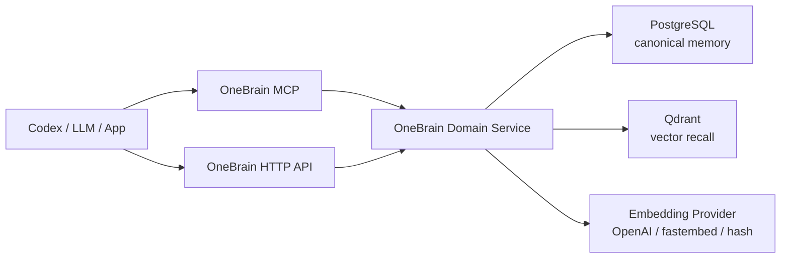

# OneBrain

OneBrain is a production-oriented memory service for LLM tools, coding agents, and personal agent workflows. It stores durable memories in PostgreSQL, indexes semantic recall vectors in Qdrant, and exposes HTTP and MCP interfaces for capture, search, deterministic correlation, and context-pack composition.

OneBrain does not use an LLM in its online request path. The service remembers, retrieves, ranks, and explains. The calling LLM, such as Codex, is responsible for deeper reasoning over the context returned by OneBrain.

## What OneBrain Does

- Captures durable memories with scope, tags, source, confidence, and entities.
- Stores canonical state in PostgreSQL.
- Stores embeddings in Qdrant for semantic recall.
- Builds deterministic context packs for LLM callers.
- Exposes a FastAPI HTTP API for applications and operations.
- Exposes an MCP server for Codex and other MCP clients.
- Supports API key authentication for deployed HTTP usage.
- Runs with Docker Compose, including PostgreSQL, Qdrant, migrations, and the API service.

## Architecture



Core responsibilities:

- **PostgreSQL**: source of truth for memories, entities, relations, audit events, metadata, and validity windows.
- **Qdrant**: vector index for recall and similarity search.
- **OneBrain API/MCP**: capture, search, correlate, explain retrieval reasons, and compose context.
- **Calling LLM**: reasoning, interpretation, conflict analysis, and task-specific decisions.

## Repository Layout

```text
.
├── src/onebrain/              # Application package
├── migrations/                # Alembic migrations
├── tests/                     # Unit tests
├── docker-compose.yml         # PostgreSQL, Qdrant, migrations, API
├── Dockerfile                 # Production container image
├── .env.example               # Local configuration template
├── CONTRIBUTING.md            # Contribution guide
└── LICENSE                    # Apache License 2.0
```

## Requirements

- Docker 27+ with Docker Compose.
- Optional for local development outside Docker:
  - Python 3.11+
  - `uv`

## Quick Start With Docker Compose

Create a local environment file:

```powershell
Copy-Item .env.example .env
```

Start the full stack:

```powershell
docker compose up -d --build
```

This starts:

- `postgres`
- `qdrant`
- `migrate`, which runs `alembic upgrade head`
- `api`, the OneBrain HTTP service

Check status:

```powershell
docker compose ps
```

Open:

- API docs: `http://localhost:8080/docs`
- Health: `http://localhost:8080/healthz`
- Readiness: `http://localhost:8080/readyz`

If port `8080` is already in use, set a different host port in `.env`:

```env
ONEBRAIN_HTTP_PORT=8088
```

Then open `http://localhost:8088/docs`.

Stop the stack:

```powershell
docker compose down
```

Stop and remove persisted local data:

```powershell
docker compose down -v
```

## Docker Compose Services

| Service | Purpose |
| --- | --- |
| `postgres` | PostgreSQL canonical memory store |
| `qdrant` | Vector database for semantic recall |
| `migrate` | One-shot Alembic migration runner |
| `api` | OneBrain FastAPI HTTP service |

The Compose file overrides container network URLs automatically:

- Docker API uses `postgres:5432`, not `localhost:5432`.
- Docker API uses `qdrant:6333`, not `localhost:6333`.

Your `.env` can still use `localhost` for host-based development.

## Configuration

Copy `.env.example` to `.env` and adjust values.

Important settings:

```env
ONEBRAIN_ENVIRONMENT=local
ONEBRAIN_API_KEYS=
ONEBRAIN_HTTP_PORT=8080

POSTGRES_DB=onebrain
POSTGRES_USER=onebrain
POSTGRES_PASSWORD=onebrain

ONEBRAIN_EMBEDDING_PROVIDER=hash
ONEBRAIN_EMBEDDING_MODEL=text-embedding-3-small
ONEBRAIN_OPENAI_API_KEY=
ONEBRAIN_VECTOR_SIZE=384
```

Embedding providers:

- `hash`: no-cost deterministic local embeddings. Good for smoke tests and local demos.
- `openai`: production semantic recall with OpenAI embeddings.
- `fastembed`: local semantic embeddings using the optional `semantic` extra.

For production OpenAI embeddings:

```env
ONEBRAIN_EMBEDDING_PROVIDER=openai
ONEBRAIN_EMBEDDING_MODEL=text-embedding-3-small
ONEBRAIN_OPENAI_API_KEY=sk-...
ONEBRAIN_VECTOR_SIZE=384
```

`text-embedding-3-small` supports configurable dimensions. OneBrain passes `ONEBRAIN_VECTOR_SIZE` to the embeddings API for `text-embedding-3*` models. If you change vector size after data exists, use a new Qdrant collection name or recreate the collection.

## Authentication

HTTP authentication is controlled by `ONEBRAIN_API_KEYS`.

For local development:

```env
ONEBRAIN_ENVIRONMENT=local
ONEBRAIN_API_KEYS=
```

An empty `ONEBRAIN_API_KEYS` disables HTTP auth. Use that only locally.

For protected usage:

```env
ONEBRAIN_ENVIRONMENT=production
ONEBRAIN_API_KEYS=dev-key-1,dev-key-2
```

Production startup fails if `ONEBRAIN_ENVIRONMENT=production` and no API key is configured.

Clients can authenticate with either header:

```http
Authorization: Bearer dev-key-1
```

or:

```http
X-API-Key: dev-key-1
```

Production recommendation:

- Put OneBrain behind TLS.
- Restrict network access to trusted callers.
- Rotate `ONEBRAIN_API_KEYS` periodically.
- Do not store secrets as memories.
- Use different API keys for humans, automation, and agents when possible.

## HTTP API Examples

If auth is enabled:

```powershell
$headers = @{ Authorization = "Bearer dev-key-1" }
```

If auth is disabled locally, omit `-Headers $headers`.

Capture a memory:

```powershell
$body = @{
  memory_type = "rule"
  title = "OneBrain runtime rule"
  content = "OneBrain must not use an LLM in the online context composer."
  scope = @{ project = "one-brain" }
  tags = @("architecture", "runtime")
  entities = @(
    @{ name = "OneBrain"; entity_type = "system" }
  )
  confidence = 1.0
  source = @{
    source_type = "user"
    source_ref = "initial design"
  }
} | ConvertTo-Json -Depth 8

Invoke-RestMethod http://localhost:8080/v1/memories `
  -Method Post `
  -ContentType "application/json" `
  -Body $body
```

Search memories:

```powershell
$body = @{
  query = "context composer without LLM"
  limit = 5
  filters = @{
    scope = @{ project = "one-brain" }
  }
} | ConvertTo-Json -Depth 8

Invoke-RestMethod http://localhost:8080/v1/search `
  -Method Post `
  -ContentType "application/json" `
  -Body $body
```

Build a context pack:

```powershell
$body = @{
  task = "How should OneBrain compose context?"
  scope = @{ project = "one-brain" }
  max_tokens = 1200
} | ConvertTo-Json -Depth 8

Invoke-RestMethod http://localhost:8080/v1/context `
  -Method Post `
  -ContentType "application/json" `
  -Body $body
```

## MCP Usage

For local Codex usage, run the MCP server from the host so stdio works naturally:

```powershell
uv sync --dev
uv run onebrain-mcp
```

Example Codex config:

```toml
[mcp_servers.onebrain]
command = "uv"
args = ["run", "onebrain-mcp"]
cwd = "C:\\Repositories\\one-brain"
startup_timeout_sec = 20
tool_timeout_sec = 60
```

Available MCP tools:

- `onebrain_capture_memory`
- `onebrain_search_memory`
- `onebrain_get_context`
- `onebrain_correlate`

## Local Development Without Docker API

You can run dependencies in Docker and the API on the host:

```powershell
docker compose up -d postgres qdrant
uv sync --dev
uv run alembic upgrade head
uv run uvicorn onebrain.api:app --host 127.0.0.1 --port 8080
```

Run tests:

```powershell
uv run pytest -q
```

Run lint:

```powershell
uv run ruff format .
uv run ruff check .
```

## Migrations

Docker Compose runs migrations automatically through the `migrate` service.

Run migrations manually:

```powershell
docker compose run --rm migrate
```

Host-based migration:

```powershell
uv run alembic upgrade head
```

Create a new migration after changing SQLAlchemy models:

```powershell
uv run alembic revision --autogenerate -m "describe change"
```

Review generated migrations before committing.

## Data Persistence

Docker volumes:

- `postgres_data`
- `qdrant_storage`

Backup expectations for production:

- PostgreSQL backups with PITR where possible.
- Qdrant snapshots.
- Migration history kept in source control.
- Explicit restore drills before relying on backups.

## Production Checklist

- Set `ONEBRAIN_ENVIRONMENT=production`.
- Set `ONEBRAIN_API_KEYS`.
- Set `ONEBRAIN_EMBEDDING_PROVIDER=openai`.
- Set `ONEBRAIN_OPENAI_API_KEY`.
- Use strong PostgreSQL credentials.
- Do not expose PostgreSQL or Qdrant publicly.
- Put HTTP behind TLS and a trusted ingress.
- Enable platform logs and metrics.
- Run `docker compose up -d --build` only after migrations are reviewed.
- Keep `.env` out of Git.

## Troubleshooting

Check service health:

```powershell
docker compose ps
docker compose logs -f api
docker compose logs -f migrate
```

If API cannot connect to Postgres inside Docker, verify the Compose override uses `postgres:5432`.

If Qdrant vector size errors appear, the existing collection was created with a different vector size. Change `ONEBRAIN_QDRANT_COLLECTION` or recreate the Qdrant volume.

If OpenAI embeddings fail at startup, verify:

```env
ONEBRAIN_EMBEDDING_PROVIDER=openai
ONEBRAIN_OPENAI_API_KEY=sk-...
```

For no-cost local testing, use:

```env
ONEBRAIN_EMBEDDING_PROVIDER=hash
```

## Contributing

Contributions are welcome. See [CONTRIBUTING.md](CONTRIBUTING.md) for the full workflow.

Short version:

1. Create a branch.
2. Keep changes focused.
3. Add or update tests.
4. Run `uv run ruff format .`, `uv run ruff check .`, and `uv run pytest -q`.
5. Update docs when behavior or configuration changes.

## License

OneBrain is licensed under the Apache License, Version 2.0. See [LICENSE](LICENSE).
