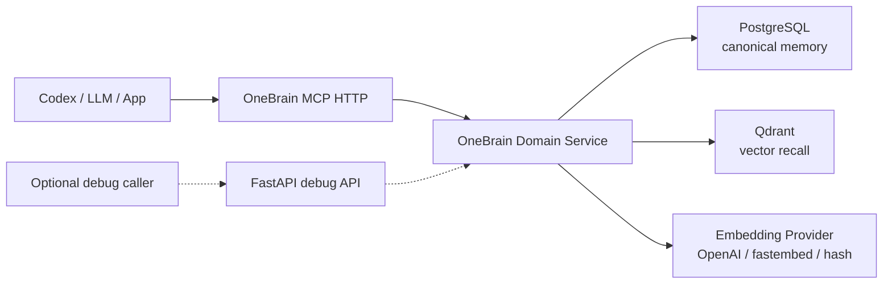

# OneBrain

OneBrain is a production-oriented memory service for LLM tools, coding agents, and personal agent workflows. It stores durable memories in PostgreSQL, indexes semantic recall vectors in Qdrant, and exposes an MCP HTTP interface for capture, search, deterministic correlation, and context-pack composition. A FastAPI REST surface remains available for optional local debugging, but it is not part of the default runtime path.

OneBrain does not use an LLM in its online request path. The service remembers, retrieves, ranks, and explains. The calling LLM, such as Codex, is responsible for deeper reasoning over the context returned by OneBrain.

## What OneBrain Does

- Captures durable memories with scope, tags, source, confidence, and entities.
- Captures declarative skills as procedural memories with capabilities, tools, and versions.
- Stores canonical state in PostgreSQL.
- Stores embeddings in Qdrant for semantic recall.
- Builds a correlation view across memories, skills, workflows, and shared entities.
- Builds deterministic context packs for LLM callers.
- Exposes an MCP HTTP server for Codex and other MCP clients.
- Keeps a FastAPI REST server as an optional debug utility.
- Supports API key authentication for deployed HTTP usage.
- Runs with Docker Compose, including PostgreSQL, Qdrant, migrations, and the MCP HTTP service.

## Architecture



Core responsibilities:

- **PostgreSQL**: source of truth for memories, entities, relations, audit events, metadata, and validity windows.
- **Qdrant**: vector index for recall and similarity search.
- **OneBrain MCP HTTP**: primary interface for capture, search, correlation, and context composition. It connects directly to the OneBrain domain service.
- **FastAPI debug API**: optional manual surface for inspecting or debugging the same service outside MCP.
- **Graph view**: local visual map of inferred shared-entity correlations.
- **Calling LLM**: reasoning, interpretation, conflict analysis, and task-specific decisions.

## Repository Layout

```text
.
├── src/onebrain/              # Application package
├── migrations/                # Alembic migrations
├── tests/                     # Unit tests
├── docker-compose.yml         # PostgreSQL, Qdrant, migrations, API
├── Dockerfile                 # Production container image
├── .env.example               # Local configuration template
├── CONTRIBUTING.md            # Contribution guide
└── LICENSE                    # Apache License 2.0
```

## Requirements

- Docker 27+ with Docker Compose.
- Optional for local development outside Docker:
  - Python 3.11+
  - `uv`

## Quick Start With Docker Compose

Create a local environment file:

```powershell
Copy-Item .env.example .env
```

Start the full stack:

```powershell
docker compose up -d --build
```

This starts:

- `postgres`
- `qdrant`
- `migrate`, which runs `alembic upgrade head`
- `mcp-http`, the OneBrain streamable HTTP MCP service

Check status:

```powershell
docker compose ps
```

Open:

- MCP health: `http://localhost:8090/healthz`
- MCP readiness: `http://localhost:8090/readyz`

If port `8090` is already in use, set a different host port in `.env`:

```env
ONEBRAIN_MCP_PORT=8091
```

Then use `http://localhost:8091/mcp`.

Stop the stack:

```powershell
docker compose down
```

Stop and remove persisted local data:

```powershell
docker compose down -v
```

## Docker Compose Services

| Service | Purpose |
| --- | --- |
| `postgres` | PostgreSQL canonical memory store |
| `qdrant` | Vector database for semantic recall |
| `migrate` | One-shot Alembic migration runner |
| `mcp-http` | Streamable HTTP MCP service protected by API key |

The Compose file overrides container network URLs automatically:

- Docker MCP uses `postgres:5432`, not `localhost:5432`.
- Docker MCP uses `qdrant:6333`, not `localhost:6333`.

Your `.env` can still use `localhost` for host-based development.

## Configuration

Copy `.env.example` to `.env` and adjust values.

Important settings:

```env
ONEBRAIN_ENVIRONMENT=local
ONEBRAIN_API_KEYS=
ONEBRAIN_MCP_PORT=8090
ONEBRAIN_MCP_REQUIRE_API_KEY=true

POSTGRES_DB=onebrain
POSTGRES_USER=onebrain
POSTGRES_PASSWORD=onebrain

ONEBRAIN_EMBEDDING_PROVIDER=hash
ONEBRAIN_EMBEDDING_MODEL=text-embedding-3-small
ONEBRAIN_OPENAI_API_KEY=
ONEBRAIN_VECTOR_SIZE=384
```

Embedding providers:

- `hash`: no-cost deterministic local embeddings. Good for smoke tests and local demos.
- `openai`: production semantic recall with OpenAI embeddings.
- `fastembed`: local semantic embeddings using the optional `semantic` extra.

For production OpenAI embeddings:

```env
ONEBRAIN_EMBEDDING_PROVIDER=openai
ONEBRAIN_EMBEDDING_MODEL=text-embedding-3-small
ONEBRAIN_OPENAI_API_KEY=sk-...
ONEBRAIN_VECTOR_SIZE=384
```

`text-embedding-3-small` supports configurable dimensions. OneBrain passes `ONEBRAIN_VECTOR_SIZE` to the embeddings API for `text-embedding-3*` models. If you change vector size after data exists, use a new Qdrant collection name or recreate the collection.

## Authentication

MCP HTTP authentication is controlled by `ONEBRAIN_API_KEYS`. The optional debug API reuses the same setting when you run it manually.

For local development:

```env
ONEBRAIN_ENVIRONMENT=local
ONEBRAIN_API_KEYS=
```

An empty `ONEBRAIN_API_KEYS` disables HTTP auth. Use that only locally.

For protected usage:

```env
ONEBRAIN_ENVIRONMENT=production
ONEBRAIN_API_KEYS=dev-key-1,dev-key-2
```

Production startup fails if `ONEBRAIN_ENVIRONMENT=production` and no API key is configured.

Clients can authenticate with either header:

```http
Authorization: Bearer dev-key-1
```

or:

```http
X-API-Key: dev-key-1
```

Production recommendation:

- Put OneBrain behind TLS.
- Restrict network access to trusted callers.
- Rotate `ONEBRAIN_API_KEYS` periodically.
- Do not store secrets as memories.
- Use different API keys for humans, automation, and agents when possible.

For client configuration, set a local client-only environment variable, for example `ONEBRAIN_MCP_CLIENT_KEY=dev-key-1`, and point your MCP client at that variable.

## Optional Debug REST API

The REST API is not part of the default Docker Compose runtime. Run it manually only when you need a debug surface outside MCP:

```powershell
uv run uvicorn onebrain.api:app --host 127.0.0.1 --port 8080
```

If auth is enabled:

```powershell
$headers = @{ Authorization = "Bearer dev-key-1" }
```

If auth is disabled locally, omit `-Headers $headers`.

Capture a memory:

```powershell
$body = @{
  memory_type = "rule"
  title = "OneBrain runtime rule"
  content = "OneBrain must not use an LLM in the online context composer."
  scope = @{ project = "one-brain" }
  tags = @("architecture", "runtime")
  entities = @(
    @{ name = "OneBrain"; entity_type = "system" }
  )
  confidence = 1.0
  source = @{
    source_type = "user"
    source_ref = "initial design"
  }
} | ConvertTo-Json -Depth 8

Invoke-RestMethod http://localhost:8080/v1/memories `
  -Method Post `
  -ContentType "application/json" `
  -Body $body
```

Capture a skill:

```powershell
$body = @{
  name = "PR Reviewer"
  description = "Reviews pull requests before merge."
  instructions = "Inspect behavioral risk, missing tests, and integration impact."
  capabilities = @("code review", "test gap analysis")
  tools = @("onebrain_search_memory")
  scope = @{ project = "one-brain" }
  tags = @("delivery")
  version = "1.0.0"
} | ConvertTo-Json -Depth 8

Invoke-RestMethod http://localhost:8080/v1/skills `
  -Method Post `
  -ContentType "application/json" `
  -Body $body
```

Search memories:

```powershell
$body = @{
  query = "context composer without LLM"
  limit = 5
  filters = @{
    scope = @{ project = "one-brain" }
  }
} | ConvertTo-Json -Depth 8

Invoke-RestMethod http://localhost:8080/v1/search `
  -Method Post `
  -ContentType "application/json" `
  -Body $body
```

Build a context pack:

```powershell
$body = @{
  task = "How should OneBrain compose context?"
  scope = @{ project = "one-brain" }
  max_tokens = 1200
} | ConvertTo-Json -Depth 8

Invoke-RestMethod http://localhost:8080/v1/context `
  -Method Post `
  -ContentType "application/json" `
  -Body $body
```

Open the correlation graph UI:

```text
http://localhost:8080/graph
```

The visual page loads its correlation data through a local `/graph/data` route. The protected
`/v1/graph` contract remains available for agents, tools, and LLM callers.

## MCP Usage

OneBrain supports two MCP modes:

- **HTTP MCP**, recommended for Codex once Docker is running.
- **stdio MCP**, useful for local development.

Both modes use the OneBrain core service directly. They do not call the optional REST API.

### HTTP MCP

Start the Docker stack:

```powershell
docker compose up -d --build
```

Make sure `.env` has:

```env
ONEBRAIN_API_KEYS=dev-key-1
ONEBRAIN_MCP_PORT=8090
ONEBRAIN_MCP_REQUIRE_API_KEY=true
```

The MCP HTTP endpoint is:

```text
http://localhost:8090/mcp
```

Recommended Codex config:

```toml
[mcp_servers.onebrain]
type = "http"
url = "http://localhost:8090/mcp"
bearer_token_env_var = "ONEBRAIN_MCP_CLIENT_KEY"
```

Set `ONEBRAIN_MCP_CLIENT_KEY` in your user environment so Codex can send it as a bearer token. Its value must match one entry in `ONEBRAIN_API_KEYS`.

### Stdio MCP

For local stdio usage, run the MCP server from the host:

```powershell
uv sync --dev
uv run onebrain-mcp
```

Example Codex config:

```toml
[mcp_servers.onebrain]
command = "uv"
args = ["run", "onebrain-mcp"]
cwd = "C:\\Repositories\\one-brain"
startup_timeout_sec = 20
tool_timeout_sec = 60
```

Because the MCP process starts with `cwd = "C:\\Repositories\\one-brain"`, it reads `.env` from this repository. That keeps API keys out of Codex config.

Available MCP tools:

- `onebrain_capture_memory`
- `onebrain_harden_memory`
- `onebrain_add_memory`
- `onebrain_harden_skill`
- `onebrain_add_skill`
- `onebrain_import_memory_files`
- `onebrain_search_memory`
- `onebrain_search_skills`
- `onebrain_get_graph`
- `onebrain_get_context`
- `onebrain_correlate`

Store one skill with source-ref dedupe:

```json
{
  "tool": "onebrain_add_skill",
  "arguments": {
    "skill": {
      "name": "PR Reviewer",
      "description": "Reviews pull requests before merge.",
      "instructions": "Inspect behavioral risk, missing tests, and integration impact.",
      "capabilities": ["code review", "test gap analysis"],
      "tools": ["onebrain_search_memory"],
      "scope": {
        "project": "one-brain"
      },
      "version": "1.0.0"
    },
    "dry_run": false
  }
}
```

Fetch a correlation slice for an agent or LLM caller:

```json
{
  "tool": "onebrain_get_graph",
  "arguments": {
    "query": "pull request review",
    "limit": 100,
    "memory_types": ["skill", "workflow", "rule"],
    "scope": {
      "project": "one-brain"
    },
    "include_entities": false,
    "include_relations": false,
    "include_correlations": true
  }
}
```

Bulk import local text files with hardening and exact `source_ref` dedupe:

```json
{
  "tool": "onebrain_import_memory_files",
  "arguments": {
    "path": "C:\\DoxieOS\\github-private-catalog\\libraries",
    "source_type": "private-catalog-library",
    "source_ref_prefix": "catalog://private/libraries",
    "scope": {
      "organization": "abinbev",
      "catalog": "private-engineering-catalog",
      "source": "private-catalog"
    },
    "dry_run": false
  }
}
```

Use `dry_run=true` to inspect counts, classifications, and redactions without storing
memories. The Docker Compose MCP HTTP service maps `C:\DoxieOS` to `/mnt/doxie` so tools can
read catalog libraries from inside the container.

## Local Development Without Docker MCP

You can run dependencies in Docker and the MCP server on the host:

```powershell
docker compose up -d postgres qdrant
uv sync --dev
uv run alembic upgrade head
uv run onebrain-mcp-http
```

Run tests:

```powershell
uv run pytest -q
```

Run lint:

```powershell
uv run ruff format .
uv run ruff check .
```

## Migrations

Docker Compose runs migrations automatically through the `migrate` service.

Run migrations manually:

```powershell
docker compose run --rm migrate
```

Host-based migration:

```powershell
uv run alembic upgrade head
```

Create a new migration after changing SQLAlchemy models:

```powershell
uv run alembic revision --autogenerate -m "describe change"
```

Review generated migrations before committing.

## Data Persistence

Docker volumes:

- `postgres_data`
- `qdrant_storage`

Backup expectations for production:

- PostgreSQL backups with PITR where possible.
- Qdrant snapshots.
- Migration history kept in source control.
- Explicit restore drills before relying on backups.

## Production Checklist

- Set `ONEBRAIN_ENVIRONMENT=production`.
- Set `ONEBRAIN_API_KEYS`.
- Set `ONEBRAIN_EMBEDDING_PROVIDER=openai`.
- Set `ONEBRAIN_OPENAI_API_KEY`.
- Use strong PostgreSQL credentials.
- Do not expose PostgreSQL or Qdrant publicly.
- Put HTTP behind TLS and a trusted ingress.
- Enable platform logs and metrics.
- Run `docker compose up -d --build` only after migrations are reviewed.
- Keep `.env` out of Git.

## Troubleshooting

Check service health:

```powershell
docker compose ps
docker compose logs -f mcp-http
docker compose logs -f migrate
```

If MCP cannot connect to Postgres inside Docker, verify the Compose override uses `postgres:5432`.

If Qdrant vector size errors appear, the existing collection was created with a different vector size. Change `ONEBRAIN_QDRANT_COLLECTION` or recreate the Qdrant volume.

If OpenAI embeddings fail at startup, verify:

```env
ONEBRAIN_EMBEDDING_PROVIDER=openai
ONEBRAIN_OPENAI_API_KEY=sk-...
```

For no-cost local testing, use:

```env
ONEBRAIN_EMBEDDING_PROVIDER=hash
```

## Contributing

Contributions are welcome. See [CONTRIBUTING.md](CONTRIBUTING.md) for the full workflow.

Short version:

1. Create a branch.
2. Keep changes focused.
3. Add or update tests.
4. Run `uv run ruff format .`, `uv run ruff check .`, and `uv run pytest -q`.
5. Update docs when behavior or configuration changes.

## License

OneBrain is licensed under the Apache License, Version 2.0. See [LICENSE](LICENSE).
