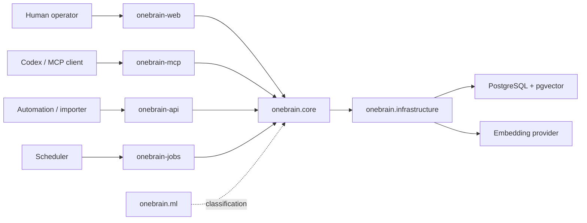

# Architecture

OneBrain has one domain core and several process surfaces. API, Web, MCP, and Jobs all share the
same application service and infrastructure code, which keeps behavior consistent while allowing
each runtime to scale or fail independently.

## Runtime Diagram

## Package Boundaries

| Package | Responsibility |
| --- | --- |
| `onebrain.core` | Domain contracts, application service, memory hardening, ingestion planning, graph logic. |
| `onebrain.infrastructure` | SQLAlchemy models, async database engine, vector store, embeddings. |
| `onebrain.interfaces.api` | HTTP API routes for memories, skills, graph, context, and ingestion. |
| `onebrain.interfaces.web` | Django host for the React web bundle and graph data endpoint. |
| `onebrain.interfaces.mcp` | MCP stdio and streamable HTTP server, auth, and tools. |
| `onebrain.platform` | Runtime settings, Django/ASGI composition, health, startup entrypoints. |
| `onebrain.workers` | Onion Ring job execution, scheduler, status, graph aggregation, classifier training. |
| `onebrain.ml` | Deterministic memory type classifier and training/evaluation commands. |
| `onebrain.tools` | Local operator tools such as contextual repository import. |

## Data Flow

1. A caller submits memory, skill, search, context, graph, or ingestion input.
2. The selected surface validates auth and request shape.
3. `onebrain.core.application.service.OneBrainService` owns business behavior.
4. Infrastructure persists memories, entities, relations, links, audit events, and vectors.
5. Graph/context responses combine explicit relations, shared entities, source metadata, and vector
   similarity.
6. LLM callers reason over the returned context. OneBrain itself does not call an LLM in the online
   request path.

## Design Commitments

- PostgreSQL with pgvector is the canonical memory and semantic recall store.
- Qdrant is not part of the base stack.
- Redis may be introduced later for cache/queue needs, not as the vector source of truth.
- Jobs use thin Django commands at the edge and keep durable lifecycle logic in `workers.ring`.
- Web is React + TypeScript + Material UI, hosted by Django for deployment consistency.
